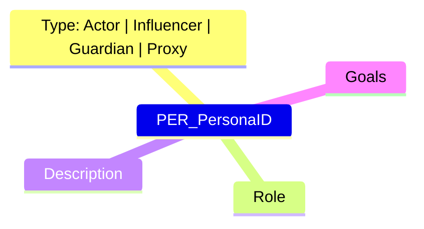

# FoundrySpec AI Agent Guide 🤖

## Introduction

**FoundrySpec** is a documentation engine designed for **Human-AI Collaborative System Analysis & Design**. Whether working on **Greenfield** (new) or **Brownfield** (existing) projects, your goal is to achieve **Zero-Question Implementation readiness**. This means the documentation you generate or read should be so exhaustive that a developer (or another agent) can implement the system without needing to ask for further clarification.

## Core Concepts

- **Graph-Based Documentation**: The documentation is a directed graph. The **Root Hub** is **automatically generated** by scanning the `docs/` directory.
- **Frontmatter Enforcement**: All `.mermaid` files MUST include a YAML frontmatter block with `id`, `title` and `description` fields.
- **Zero-Question Implementation**: Strive for maximum detail in your specs.

### The Four Persona Types

To achieve complete system understanding, you must identify four distinct types of personas. Each drives specific layers of the system design:

1.  **The End-User Persona ("The Actor")**

    - **Definition**: Traditional personas who interact with the UI or API to achieve goals.
    - **Examples**: The Shopper, The Data Scientist, The IoT Device Owner.
    - **Traceability Impact**: Drives **L3 Component** design (UX, Latency, Accessibility).

2.  **The Stakeholder Persona ("The Influencer")**

    - **Definition**: People who don't use the software but define its success constraints.
    - **Examples**: The CTO (cost), The Product Manager (time-to-market).
    - **Traceability Impact**: Drives **L1 Context** (e.g., "Serverless to minimize overhead").

3.  **The Regulatory Persona ("The Guardian")**

    - **Definition**: External bodies or legal frameworks that "act" through audits and compliance.
    - **Examples**: GDPR/CCPA, SOC2 Auditor, HIPAA.
    - **Traceability Impact**: Drives **L2 Boundaries** (e.g., "Database isolation in EU region").

4.  **The System Persona ("The Proxy")**
    - **Definition**: External systems that impose requirements on your system.
    - **Examples**: Legacy Mainframes, Payment Gateways.
    - **Traceability Impact**: Drives **L3 Interfaces** (e.g., "Must support XML for legacy compat").

### 📐 Persona Mindmap Structure

Every Persona MUST be a `mindmap` with the following branch structure:

- **Type**: Must be exactly one of the four types above.
- **Traceability (Ghost Rule)**: Every Persona MUST Drive at least one Requirement ID (`REQ_`) via Mermaid nodes or `requirements` frontmatter. A persona without requirements is a **Ghost in the System** and will cause a build failure.

## 📝 Critical Rules for Agents

### 1. Frontmatter is Mandatory
To be written properly

### 2. No orphan policy
To be written properly

## Command Reference

You can invoke the FoundrySpec CLI using `foundryspec` (if installed globally) or via the locally scaffolded scripts. To see the list of available foundryspec command run `foundryspec --help`

## 📐 Mandatory Spec Metadata

To maintain architectural integrity, every spec file MUST include these top-level frontmatter fields:

1.  **`id`**: A unique stable identifier (e.g., `PER_User`, `REQ_Login`, `COMP_Auth`).
2.  **`requirements`**: An array of granular `REQ_` IDs associated with this asset. (Mandatory for Personas and Components).
3.  **`entities`**: (Optional) A list of internal IDs defined within this file.

### 📝 Footnote Policy (Markdown Rules)

Markdown files (`.md`) are NOT first-class architectural citizens. They serve exclusively as **Footnotes** to diagrams.

1.  **Directory**: All `.md` files must live in a `footnotes/` subdirectory relative to the diagram they supplement.
2.  **Surgical Addressing**: A footnote's `id` MUST match an existing node ID defined OR linked in a `.mermaid` blueprint.
3.  **Directory Isolation**: A footnote can ONLY target IDs referenced in blueprints within its own parent directory.
