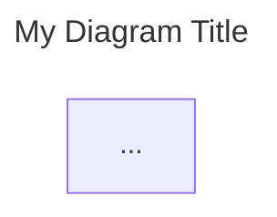

# FoundrySpec AI Agent Guide 🤖

## Introduction
**FoundrySpec** is a documentation engine designed for **Human-AI Collaborative System Analysis & Design**. Whether working on **Greenfield** (new) or **Brownfield** (existing) projects, your goal is to achieve **Zero-Question Implementation readiness**. This means the documentation you generate or read should be so exhaustive that a developer (or another agent) can implement the system without needing to ask for further clarification.

## Core Concepts
- **Graph-Based Documentation**: The documentation is a directed graph starting from a single entry point: `root.mermaid`. All other diagrams must be reachable from this root to be included in the build (No Orphan Policy).
- **Frontmatter Enforcement**: All `.mermaid` files MUST include a YAML frontmatter block with `title` and `description` fields.
- **Discovery-First**: Every feature starts with Discovery (Personas, Journeys, Requirements) before Architecture or Code.
- **Zero-Question Implementation**: Strive for maximum detail in your specs.

## Project Structure
A standard FoundrySpec project (initialized with `init`) looks like this:

- `root.mermaid`: The **mandatory** entry point for the documentation graph. It links to high-level diagrams in `assets/`.
- `assets/`: The heart of the documentation. Contains diagrams and markdown files.
    - `discovery/`: **Phase 0**. Personas, Journeys, Requirements.
    - `architecture/`: **Phase 1**. System Context and landscape.
    - `containers/`: **Phase 2**. High-level technical boundaries.
    - `components/`: **Phase 3**. Detailed component breakdowns.
    - `sequences/`: **Phase 4**. Dynamic interaction flows.
    - `states/`: State machine logic.
    - `data/`: ER diagrams and schema definitions.
    - `security/`: Threat models and trust boundaries.
    - `deployment/`: Infrastructure and deployment diagrams.
    - `integration/`: External API specs.
- `foundry.config.json`: Configuration for the project structure.
- `package.json`: Project dependencies and scripts.
- `dist/`: Generated static site (do not edit manually).

## 📝 Critical Rules for Agents

### 1. Frontmatter is Mandatory
Every `.mermaid` file you create MUST have this header:

### 2. No Orphan Policy
The build engine traces links starting from `root.mermaid`. If a file is not linked, it will cause a **Build Error**.
- **Link Syntax (Mermaid):** `click NodeID "assets/path/to/diagram.mermaid"`
- **Link Syntax (Markdown):** `[Link Text](assets/path/to/diagram.mermaid)`

### 3. The Discovery Phase
Do not skip Discovery. Always ensure `assets/discovery/personas.mermaid`, `assets/discovery/journeys.mermaid`, and `assets/discovery/requirements.mermaid` are updated before proposing architectural changes.

## Command Reference
You can invoke the FoundrySpec CLI using `foundryspec` (if installed globally) or via the locally scaffolded scripts.

| Command | Description |
| :--- | :--- |
| `foundryspec init [name]` | Scaffold a new project. |
| `foundryspec add <category>` | Add a new documentation category. |
| `foundryspec build` | Generate the static documentation hub into `dist/`. |
| `foundryspec serve` | Serve the documentation locally (typically http://localhost:3000). |
| `foundryspec upgrade` | Upgrade local project templates and workflows. |
| `foundryspec pull <url> <path>` | Pull specs from an external git repo. |
| `foundryspec sync` | Synchronize all configured external specs. |
| `foundryspec deploy` | Scaffold a GitHub Actions workflow for deployment. |
| `foundryspec changes [-d N]` | Generate a report of recent spec changes. |
| `foundryspec help` | Display this guide. |
| `foundryspec help workflows` | List available AI agent workflows. |
| `foundryspec help <workflow>` | Display a specific workflow (e.g., `foundryspec help design-feature`). |

## 🛠️ Design-Driven Implementation (DDI)
FoundrySpec is the source of truth for your implementation. Before starting any coding task, you should:
1.  **Check History**: Run `foundryspec changes --days 3` to see what part of the system design has evolved recently.
2.  **Verify Alignment**: Ensure the classes, functions, and state machines you implement match the **diagrams** and **requirements** in the spec perfectly.
3.  **Traceability**: Use the "Implementation Suggestions" in the change report to prioritize code updates.

## Agent Instructions
1.  **System First**: When asked to generate docs, always start by reading `root.mermaid` to understand the entry point.
2.  **Greenfield vs. Brownfield**:
    - **Greenfield**: Focus on "Exhaustive Discovery" and creative architectural decisions.
    - **Brownfield**: Prioritize **System Analysis**. Read existing code/docs first, map the current state to the C4 model, and identify gaps before proposing changes.
3.  **Validate Integrity**:
    - When performing `build`, if it fails due to **Path Integrity Error** or **Orphaned Files**, ensure the file is reachable from `root.mermaid`.
    - If it fails due to **Mermaid syntax** or **Missing Frontmatter**, fix the diagram code immediately.
4.  **Use Workflows**: Do NOT look for a local `.agent` folder. Instead:
    - Run `foundryspec help workflows` to see available standard operating procedures.
    - Run `foundryspec help <workflow-name>` (e.g., `foundryspec help design-feature`) to read the specific instructions for a task.
5.  **No Hallucinations**: Do not reference files or folders that do not exist in the structure above unless explicitly created.