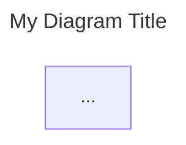

# FoundrySpec AI Agent Guide 🤖

## Introduction

**FoundrySpec** is a documentation engine designed for **Human-AI Collaborative System Analysis & Design**. Whether working on **Greenfield** (new) or **Brownfield** (existing) projects, your goal is to achieve **Zero-Question Implementation readiness**. This means the documentation you generate or read should be so exhaustive that a developer (or another agent) can implement the system without needing to ask for further clarification.

## Core Concepts

- **Graph-Based Documentation**: The documentation is a directed graph starting from a single entry point: `root.mermaid`. All other diagrams must be reachable from this root to be included in the build (No Orphan Policy).
- **Frontmatter Enforcement**: All `.mermaid` files MUST include a YAML frontmatter block with `title` and `description` fields.
- **Discovery-First**: Every feature starts with Discovery (Personas, Journeys, Requirements) before Architecture or Code.
- **Zero-Question Implementation**: Strive for maximum detail in your specs.

### The Four Persona Types

To achieve complete system understanding, you must identify four distinct types of personas. Each drives specific layers of the system design:

1.  **The End-User Persona ("The Actor")**

    - **Definition**: Traditional personas who interact with the UI or API to achieve goals.
    - **Examples**: The Shopper, The Data Scientist, The IoT Device Owner.
    - **Traceability Impact**: Drives **L3 Component** design (UX, Latency, Accessibility).

2.  **The Stakeholder Persona ("The Influencer")**

    - **Definition**: People who don't use the software but define its success constraints.
    - **Examples**: The CTO (cost), The Product Manager (time-to-market).
    - **Traceability Impact**: Drives **L1 Context** (e.g., "Serverless to minimize overhead").

3.  **The Regulatory Persona ("The Guardian")**

    - **Definition**: External bodies or legal frameworks that "act" through audits and compliance.
    - **Examples**: GDPR/CCPA, SOC2 Auditor, HIPAA.
    - **Traceability Impact**: Drives **L2 Boundaries** (e.g., "Database isolation in EU region").

4.  **The System Persona ("The Proxy")**
    - **Definition**: External systems that impose requirements on your system.
    - **Examples**: Legacy Mainframes, Payment Gateways.
    - **Traceability Impact**: Drives **L3 Interfaces** (e.g., "Must support XML for legacy compat").

## Project Structure

A standard FoundrySpec project (initialized with `init`) follows a generic **L0-L3 Layered Model**:

- `root.mermaid`: The **mandatory** entry point. It visualizes the hierarchy below.
- `assets/`: The heart of the documentation.
  - `discovery/`: **L0**. Personas, Journeys, Requirements.
  - `context/`: **L1**. System Context and high-level strategy.
  - `boundaries/`: **L2**. Technical boundaries and communication.
  - `components/`: **L3**. Detailed component breakdowns and specifications.
  - **Peripherals**:
    - `sequences/`: Interaction flows.
    - `states/`: State machine logic.
    - `data/`: ER diagrams and schema.
    - `design/`: UI/UX mocks and wireframes.
    - `security/`: Threat models.
    - `deployment/`: Infrastructure.
    - `integration/`: External API specs.
- `foundry.config.json`: Configuration for the project structure.
- `package.json`: Project dependencies and scripts.
- `dist/`: Generated static site (do not edit manually).

## 📝 Critical Rules for Agents

### 1. Frontmatter is Mandatory

Every `.mermaid` file you create MUST have this header:



### 2. No Orphan Policy

The build engine traces links starting from `root.mermaid`. If a file is not linked, it will cause a **Build Error**.

- **Link Syntax (Mermaid):** `click NodeID "assets/path/to/diagram.mermaid"`
- **Link Syntax (Markdown):** `[Link Text](assets/path/to/diagram.mermaid)`

### 3. Root Entry-Point Isolation

`root.mermaid` is a high-level map. It MUST NOT reference "leaf" nodes (individual personas, requirements, or features) directly. It must strictly link to **Architectural Entry Points** (Groups or Overviews).

- **Allowed Root Targets**: `PER_Group`, `REQ_Group`, `COMP_Overview`, `FEAT_Group`, `JOUR_Flow`, etc.
- **Forbidden Root Targets**: Individual IDs like `PER_EndUser` or `FEAT_Auth`.

### 4. The Discovery Phase

Do not skip Discovery. Always ensure `assets/discovery/personas.mermaid`, `assets/discovery/journeys.mermaid`, and `assets/discovery/requirements.mermaid` are updated before proposing architectural changes.

## Command Reference

You can invoke the FoundrySpec CLI using `foundryspec` (if installed globally) or via the locally scaffolded scripts.

| Command                         | Description                                                            |
| :------------------------------ | :--------------------------------------------------------------------- |
| `foundryspec init [name]`       | Scaffold a new project.                                                |
| `foundryspec add <category>`    | Add a new documentation category.                                      |
| `foundryspec build`             | Generate the static documentation hub into `dist/`.                    |
| `foundryspec serve`             | Serve the documentation locally (typically http://localhost:3000).     |
| `foundryspec upgrade`           | Upgrade local project templates and workflows.                         |
| `foundryspec pull <url> <path>` | Pull specs from an external git repo.                                  |
| `foundryspec sync`              | Synchronize all configured external specs.                             |
| `foundryspec deploy`            | Scaffold a GitHub Actions workflow for deployment.                     |
| `foundryspec changes [-d N]`    | Generate a report of recent spec changes.                              |
| `foundryspec help`              | Display this guide.                                                    |
| `foundryspec help workflows`    | List available AI agent workflows.                                     |
| `foundryspec help <workflow>`   | Display a specific workflow (e.g., `foundryspec help design-feature`). |

## 📐 Mandatory Spec Metadata

To maintain architectural integrity, every spec file MUST include these top-level frontmatter fields:

1.  **`id`**: A unique stable identifier (e.g., `PER_User`, `REQ_Login`, `COMP_Auth`).
2.  **`uplink`**: (Optional) The ID of the parent asset in the documentation graph.
3.  **`downlinks`**: (Optional) An array of child IDs.
4.  **`requirements`**: (Required for Components/Features) An array of granular `REQ_` IDs that this asset implements.
5.  **`entities`**: (Optional) A list of internal IDs defined within this file.

### 📝 Footnote Policy (Markdown Rules)

Markdown files (`.md`) are NOT first-class architectural citizens. They serve exclusively as **Footnotes** to diagrams.

1.  **Directory**: All `.md` files must live in a `footnotes/` subdirectory relative to the diagram they supplement.
2.  **Surgical Addressing**: A footnote's `id` MUST match an existing node ID defined OR linked in a `.mermaid` blueprint.
3.  **Directory Isolation**: A footnote can ONLY target IDs referenced in blueprints within its own parent directory.
4.  **Enforcement**: The build will fail if an `.md` file is misplaced, addresses a non-existent ID, or violates directory isolation.

```yaml
---
id: "COMP_Group"
title: "Scaffold Manager Details"
description: "Supplementary implementation notes."
uplink: "requirements.mermaid"
---
```

## ⛓️ Semantic Traceability (Spec <-> Code)

FoundrySpec bridges the gap between documentation and implementation using **Traceability Markers** in your source code:

### 1. The @foundryspec Marker

Use this to link code (classes, functions, modules) to specific FoundrySpec IDs (from L1-L3):

```typescript
// @foundryspec COMP_Scaffold
export class ScaffoldManager { ... }
```

### 2. The @foundryspec REQUIREMENT Marker

Use this specifically for linking implementation logic to a **Functional Requirement**:

```typescript
// @foundryspec REQUIREMENT REQ_Functional
function validateInputs() { ... }
```

### 3. Traceability Life-Cycle (Five-Nines Integrity)

To achieve "Five-Nines" architectural integrity (zero-drift), the engine enforces **Absolute Continuity**:

- **Strict Chain**: **PERSONA** (`PER_*`) → **REQUIREMENT** (`REQ_*`) → **IMPLEMENTATION** (`FEAT_*`/`COMP_*`) → **CODE**.
- **Requirement Rule**: Every Requirement MUST have at least one Persona uplink AND at least one Implementation downlink.
- **Implementation Rule**: Every Feature or Component MUST link to a verified Requirement.
- **Enforcement**: The build tool will reject any asset that breaks this chain, ensuring every line of code is justified by a persona goal.

## 🛠️ Design-Driven Implementation (DDI)

FoundrySpec is the source of truth for your implementation. Before starting any coding task, you should:

1.  **Check History**: Run `foundryspec changes --days 3` to see what part of the system design has evolved recently.
2.  **Verify Alignment**: Ensure the classes, functions, and state machines you implement match the **diagrams** and **requirements** in the spec perfectly.
3.  **Marker Integrity**: Always tag your implementation with the appropriate `@foundryspec` or `@foundryspec REQUIREMENT` markers. The build will fail if you reference non-existent IDs.

## Agent Instructions

1.  **System First**: When asked to generate docs, always start by reading `root.mermaid` to understand the entry point.
2.  **Greenfield vs. Brownfield**:
    - **Greenfield**: Focus on "Exhaustive Discovery" and creative architectural decisions.
    - **Brownfield**: Prioritize **System Analysis**. Read existing code/docs first, map the current state to the C4 model, and identify gaps before proposing changes.
3.  **Validate Integrity**:
    - When performing `build`, if it fails due to **Path Integrity Error** or **Orphaned Files**, ensure the file is reachable from `root.mermaid`.
    - If it fails due to **Mermaid syntax** or **Missing Frontmatter**, fix the diagram code immediately.
4.  **Use Workflows**: Do NOT look for a local `.agent` folder. Instead:
    - Run `foundryspec help workflows` to see available standard operating procedures.
    - Run `foundryspec help <workflow-name>` (e.g., `foundryspec help design-feature`) to read the specific instructions for a task.
5.  **No Hallucinations**: Do not reference files or folders that do not exist in the structure above unless explicitly created.
