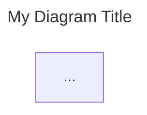

# FoundrySpec AI Agent Guide 🤖

## Introduction

**FoundrySpec** is a documentation engine designed for **Human-AI Collaborative System Analysis & Design**. Whether working on **Greenfield** (new) or **Brownfield** (existing) projects, your goal is to achieve **Zero-Question Implementation readiness**. This means the documentation you generate or read should be so exhaustive that a developer (or another agent) can implement the system without needing to ask for further clarification.

## Core Concepts

- **Graph-Based Documentation**: The documentation is a directed graph. The **Root Hub** is **automatically generated** by scanning the `docs/` directory.
- **Frontmatter Enforcement**: All `.mermaid` files MUST include a YAML frontmatter block with `title` and `description` fields.
- **Discovery-First**: Every feature starts with Discovery (Personas, Journeys, Requirements) before Architecture or Code.
- **Zero-Question Implementation**: Strive for maximum detail in your specs.

### The Four Persona Types

To achieve complete system understanding, you must identify four distinct types of personas. Each drives specific layers of the system design:

1.  **The End-User Persona ("The Actor")**

    - **Definition**: Traditional personas who interact with the UI or API to achieve goals.
    - **Examples**: The Shopper, The Data Scientist, The IoT Device Owner.
    - **Traceability Impact**: Drives **L3 Component** design (UX, Latency, Accessibility).

2.  **The Stakeholder Persona ("The Influencer")**

    - **Definition**: People who don't use the software but define its success constraints.
    - **Examples**: The CTO (cost), The Product Manager (time-to-market).
    - **Traceability Impact**: Drives **L1 Context** (e.g., "Serverless to minimize overhead").

3.  **The Regulatory Persona ("The Guardian")**

    - **Definition**: External bodies or legal frameworks that "act" through audits and compliance.
    - **Examples**: GDPR/CCPA, SOC2 Auditor, HIPAA.
    - **Traceability Impact**: Drives **L2 Boundaries** (e.g., "Database isolation in EU region").

4.  **The System Persona ("The Proxy")**
    - **Definition**: External systems that impose requirements on your system.
    - **Examples**: Legacy Mainframes, Payment Gateways.
    - **Traceability Impact**: Drives **L3 Interfaces** (e.g., "Must support XML for legacy compat").

## Project Structure

A standard FoundrySpec project (initialized with `init`) follows a generic **L0-L3 Layered Model**:

- `.foundryid`: The unique identifier for the project (do not edit).
- `docs/`: The heart of the documentation.
  - `discovery/`: **L0**. Personas, Journeys, Requirements.
    - `personas/`: Individual Persona mindmaps (`PER_*.mermaid`).
    - `requirements/`: Requirement diagrams (`REQ_*.mermaid`).
    - `journeys/`: User Journey sequence diagrams (`JRN_*.mermaid`).
  - `context/`: **L1**. System Context and high-level strategy.
  - `boundaries/`: **L2**. Technical boundaries and communication.
  - `components/`: **L3**. Detailed component breakdowns and specifications.
  - **Peripherals**:
    - `sequences/`: Interaction flows.
    - `states/`: State machine logic.
    - `data/`: ER diagrams and schema.
    - `design/`: UI/UX mocks and wireframes.
    - `security/`: Threat models.
    - `deployment/`: Infrastructure.
    - `integration/`: External API specs.
    - `others/`: Foreign files (images, PDFs, binaries).
- `package.json`: Project dependencies and scripts.

**Note:** `root.mermaid` is **auto-generated** during the build. You do not need to create it manually. The system will automatically index any subdirectories created in `docs/`.

## 📝 Critical Rules for Agents

### 1. Frontmatter is Mandatory

Every `.mermaid` file you create MUST have this header:



### 2. Dynamic Linking (No Orphan Policy)

The build engine traces links starting from the auto-generated Root Hub. **You no longer need to use the Mermaid `click` syntax.**

FoundrySpec handles navigation dynamically:
- If a Node's **ID** or **Text Label** matches the `id` defined in another spec file's frontmatter, the system automatically makes that node clickable.
- Ensure your Node IDs or Labels are consistent with the `id` fields in the target files.
- For manual Markdown links, use: `[Link Text](docs/path/to/diagram.mermaid)`.

### 3. Root Entry-Point Isolation

The Root Hub is managed by the system. It links to high-level Category Indices (e.g., `GRP_Components`, `GRP_Discovery`). You should not attempt to link directly to the Root.

### 4. The Discovery Phase

Do not skip Discovery. Always ensure that Personas, Journeys, and Requirements are defined in their respective subfolders within `docs/discovery/`.

- **Personas**: `docs/discovery/personas/PER_*.mermaid` (Must be `mindmap`)
- **Requirements**: `docs/discovery/requirements/REQ_*.mermaid` (Must be `requirementDiagram`)
- **Journeys**: `docs/discovery/journeys/JRN_*.mermaid` (Must be `sequenceDiagram`)

## Command Reference

You can invoke the FoundrySpec CLI using `foundryspec` (if installed globally) or via the locally scaffolded scripts.

| Command                         | Description                                                            |
| :------------------------------ | :--------------------------------------------------------------------- |
| `foundryspec init [name]`       | Scaffold a new project.                                                |
| `foundryspec add <category>`    | Add a new documentation category.                                      |
| `foundryspec build`             | Generate the static documentation hub (stored internally).             |
| `foundryspec serve`             | Serve the documentation locally (typically http://localhost:3000).     |
| `foundryspec upgrade`           | Upgrade local project templates and workflows.                         |
| `foundryspec pull <url> <path>` | Pull specs from an external git repo.                                  |
| `foundryspec sync`              | Synchronize all configured external specs.                             |
| `foundryspec deploy`            | Scaffold a GitHub Actions workflow for deployment.                     |
| `foundryspec changes [-d N]`    | Generate a report of recent spec changes.                              |
| `foundryspec help`              | Display this guide.                                                    |
| `foundryspec help workflows`    | List available AI agent workflows.                                     |
| `foundryspec help <workflow>`   | Display a specific workflow (e.g., `foundryspec help design-feature`). |

## 📐 Mandatory Spec Metadata

To maintain architectural integrity, every spec file MUST include these top-level frontmatter fields:

1.  **`id`**: A unique stable identifier (e.g., `PER_User`, `REQ_Login`, `COMP_Auth`).
2.  **`uplink`**: (Optional) The ID of the parent asset in the documentation graph.
3.  **`downlinks`**: (Optional) An array of child IDs.
4.  **`requirements`**: (Required for Components/Features) An array of granular `REQ_` IDs that this asset implements.
5.  **`entities`**: (Optional) A list of internal IDs defined within this file.

### 📝 Footnote Policy (Markdown Rules)

Markdown files (`.md`) are NOT first-class architectural citizens. They serve exclusively as **Footnotes** to diagrams.

1.  **Directory**: All `.md` files must live in a `footnotes/` subdirectory relative to the diagram they supplement.
2.  **Surgical Addressing**: A footnote's `id` MUST match an existing node ID defined OR linked in a `.mermaid` blueprint.
3.  **Directory Isolation**: A footnote can ONLY target IDs referenced in blueprints within its own parent directory.
4.  **Enforcement**: The build will fail if an `.md` file is misplaced, addresses a non-existent ID, or violates directory isolation.

```yaml
---
id: "COMP_ScaffoldManager"
title: "Scaffold Manager Details"
description: "Supplementary implementation notes."
uplink: "GRP_Components"
---
```

## ⛓️ Semantic Traceability (Spec <-> Code)

FoundrySpec bridges the gap between documentation and implementation. **To save token counts, AI Agents do not need to manually verify traceability.** Simply provide the correct IDs in your diagrams and implementation markers; the **FoundrySpec Build Engine** will automatically validate the graph and alert you to any breaks.

### 1. The @foundryspec Marker
... (rest of markers) ...

## 🛠️ Zero-Question Readiness Checklist

The "Zero-Question" metric is satisfied when your documentation passes this objective checklist:

1.  **Actor Alignment**: Does every feature link back to a `PER_` Persona?
2.  **Boundary Integrity**: Are all cross-boundary communications (L2) labeled with a protocol (e.g., gRPC, REST)?
3.  **State Completeness**: Does every complex data object have a corresponding `stateDiagram`?
4.  **Interface Clarity**: Do L3 Components define their public methods/interfaces?
5.  **Build Pass**: Does `foundryspec build` pass with zero "Orphan" or "Path Integrity" errors?

## Agent Instructions

1.  **Focus on Intent**: Your primary job is to capture architectural intent. Let the build tool handle the validation.
2.  **Optional Footnotes**: Do not feel compelled to create `footnotes/` folders or `.md` files unless a diagram node is too complex to be self-explanatory.
3.  **Greenfield vs. Brownfield**:
    - **Greenfield**: Use the `design-feature` workflow to scaffold new logic.
    - **Brownfield**: Map existing code to IDs first, then use `foundryspec changes` to identify gaps.
